**Directions:** *There are 2 passages in this section. Each passage is followed by some questions or unfinished statements. For each of them there are four choices marked A), B), C) and D). You should decide on the best choice and mark the corresponding letter on Answer Sheet 2 with a single line through the centre.*

### 2017年6月卷一

**Passage One**
**Questions 46 to 50 are based on the following passage.**

The phrase almost completes itself: midlife crisis. It’s the stage in the middle of the journey when people feel youth vanishing, their prospects narrowing and death approaching.

There’s only one problem with the cliche (套话).It isn’t true.

“In fact, there is almost no hard evidence for midlife crisis other than a few small pilot studies conducted decades ago,” Barbara Hagerty writes in her new book, Life Reimagined. The vast bulk of the research shows that there may be a pause, or a shifting of gears in the 40s or 50s, but this shift “can be exciting, rather than terrifying”.

Barbara Hagerty looks at some of the features of people who turn midlife into a rebirth. They break routines, because “autopilot is death”. They choose purpose over happiness一having a clear sense of purpose even reduces the risk of Alzheimer’s disease. They give priority to relationships, as careers often recede(逐渐淡化).

Life Reimagined paints a picture of middle age that is far from gloomy. Midlife seems like the second big phase of decision-making. Your identity has been formed; you’ve built up your resources; and now you have the chance to take the big risks precisely because your foundation is already secure.

Karl Barth described midlife precisely this way. At middle age, he wrote, “the sowing is behind; now is the time to reap. The run has been taken; now is the time to leap. Preparation has been made; now is the time for the venture of the work itself.”

The middle-aged person, Barth continued, can see death in the distance, but moves with a “measured haste” to get big new things done while there is still time.

What Barth wrote decades ago is even truer today. People are healthy and energetic longer. We have presidential candidates running for their first term in office at age 68, 69 and 74. A longer lifespan is changing the narrative structure of life itself. What could have been considered the beginning of a descent is now a potential turning point—the turning point you are most equipped to take full advantage of.

**46.** **What does the author think of the phrase “midlife crisis”？**
A) It has led to a lot of debate.      
B) It is widely acknowledged. 
C) It is no longer fashionable.      
D) It misrepresents real life.

**47.** **How does Barbara Hagerty view midlife?**
A) It may be the beginning of a crisis.
B) It can be a new phase of one’s life.
C) It can be terrifying for the unprepared.
D) It may see old-age diseases approaching.

**48.** **How is midlife pictured in the book Life Reimagined?**
A) It can be quite rose.
B) It can be burdensome.
C) It undergoes radical transformation.
D) It makes for the best part of one’s life.

**49.** **According to Karl Barth, midlife is the time_______.**
A) to relax.        
B) to mature.
C) to harvest.        
D) to reflect.

**50.** **What does the author say about midlife today?**
A) It is more meaningful than other stages of life.
B) It is likely to change the narrative of one’s life,
C) It is more important to those with a longer lifespan.
D) It is likely to be a critical turning point in one’s life. 

**Passage Two**
**Questions 51 to 55 are based on the following passage.**

In spring, chickens start laying again, bringing a welcome source of protein at winter’s end. So it’s no surprise that cultures around the world celebrate spring by honoring the egg.

Some traditions are simple, like the red eggs that get baked into Greek Easter breads. Others elevate the egg into a fancy art, like the heavily jewel-covered “eggs” that were favored by the Russians starting in the 19th century.

One ancient form of egg art comes to us from Ukraine. For centuries, Ukrainians have been drawing complicated patterns on eggs. Contemporary artists have followed this tradition to create eggs that speak to the anxieties of our age: Life is precious, and delicate. Eggs are, too.

“There’s something about their delicate nature that appeals to me,” says New Yorker cartoonist Roz Chast. Several years ago, she became interested in eggs and learned the traditional Ukrainian technique to draw her very modem characters. “I’ve broken eggs at every stage of the process—from the very beginning to the very, very end.”

But there’s an appeal in that vulnerability. “There’s part of this sickening horror of knowing you’re walking on the edge with this, that I kind of like, knowing that it could all fall apart at any second.” Chast’s designs, such as a worried man alone in a tiny rowboat, reflect that delicateness.

Traditional Ukrainian decorated eggs also spoke to those fears. The elaborate patterns were believed to offer protection against evil.

“There’s an ancient legend that as long as these eggs are made, evil will not prevail in the world,” says Joan Brander, a Canadian egg-painter who has been painting eggs for over 60 years, having learned the art from her Ukrainian relatives.

The tradition, dating back to 300 B.C., was later incorporated into the Christian church. The old symbols, however, still endure. A decorated egg with a bird on it, given to a young married couple, is a wish for children. A decorated egg thrown into the field would be a wish for a good harvest.

**51.** **Why do people in many cultures prize the egg?**
A) It is a welcome sign of the coming of spring.
B) It is their major source of protein in winter.
C) It can easily be made into a work of art.
D) It can bring wealth and honor to them.

**52.** **What do we learn about the decorated “eggs” in Russia?**
A) They are shaped like jewel cases.
B) They are cherished by the rich.
C) They are heavily painted in red.
D) They are favored as a form of art.

**53.** **Why have contemporary artists continued the egg art tradition?**
A) Eggs serve as an enduring symbol of new life.
B) Eggs have an oval shape appealing to artists.
C) Eggs reflect the anxieties of people today.
D) Eggs provide a unique surface to paint on.

**54.** **Why does Chast enjoy the process of decorating eggs?**
A) She never knows if the egg will break before the design is completed.
B) She can add multiple details to the design to communicate her idea.
C) She always derives great pleasure from designing something new.
D) She is never sure what the final design will look like until the end.

**55.** **What do we learn from the passage about egg-painting?**
A) It originated in the eastern part of Europe.
B) It has a history of over two thousand years.
C) It is the most time-honored form of fancy art.
D) It is especially favored as a church decoration.

### 2017年6月卷二

**Passage One**
**Questions 46 to 50 are based on the following passage.**

The Urbanization — migration away from the suburbs to the city center — will be the biggest real estate trend in 2015, according to a new report.

The report says America’s urbanization will continue to be the most significant issue affecting the industry, as cities across the country imitate the walkability and transit-oriented development making cities like New York and San Francisco so successful.

As smaller cities copy the model of these “24-hour cities，’’ tfiore affordable versions of these places will be created. The report refers to this as the coming of the “18-hour city，”，and uses the term to refer to cities like Houston, Austin, Charlotte, and Nashville, which are “positioning themselves as highly competitive, in terms of livability, employment offerings, and recreational and cultural facilities.” 

Another trend that looks significant in 2015 is that America’s largest population group, Millennials (千禧一代)，will continue to put off buying a house. Apartments will retain their appeal for a while for Millennials, haunted by what happened to home-owning parents.

This trend will continue into the 2020s, the report projects. After that, survey respondents disagree over whether this generation will follow in their parents，footsteps, moving to the suburbs to raise families, or will choose to remain in the city center.

Another issue affecting real estate in the coming year will be America’s failing infrastructure. Most roads, bridges, transit, water systems, the electric grid, and communications networks were installed 50 to 100 years ago, and they are largely taken for granted until they fail.

The report’s writers state that America’s failure to invest in infrastructure impacts not only the health of the real-estate market, but also our ability to remain globally competitive.

Apart from the specific trends highlighted above, which cause some investors to worry, the report portrays an overall optimism borne by the recent healthy real-estate “upcycle” and improving economy. Seventy-four percent of the respondents surveyed report a “good to excellent” expectation of real-estate profitability in 2015. While excessive optimism can promote bad investment patterns, resulting in a real- estate “bubble,” the report’s writers downplay that potential outcome in that it has not yet occurred.

**46. According to the new report, real estate development in 2015 will witness_______ .**
A) an accelerating speed.
B) a shift to city centers.
C) a new focus on small cities.
D) an ever-increasing demand.

**47. What characterizes “24-hour cities” like New York?**
A) People can live without private cars.
B) People are generally more competitive.
C) People can enjoy services around the clock.
D) People are in harmony with the environment.

**48.** **Why are Millennials reluctant to buy a house?**
A) They can only afford small apartments.
B) The house prices are currently too high.
C) Their parents' bad experience still haunts them.
D) They feel attached to the suburban environment.

**49. What might hinder real estate development in the U.S.?**
A) The continuing economic recession in the country.
B) The lack of confidence on the part of investors.
C) The fierce global competition.
D) The worsening infrastructure.

**50. How do most of the respondents in the survey feel about the U.S. real-estate market in 2015?**
A) Pessimistic.          
B) Hopeful.
C) Cautious.           
D) Uncertain. 

**Passage Two**
**Questions 51 to 55 are based on the following passage.**

The brain is a seemingly endless library, whose shelves house our most precious memories as well as our lifetime’s knowledge. But is there a point where it reaches capacity?

The answer is no, because brains are more sophisticated than that. Instead of just crowding in, old information is sometimes pushed out of the brain for new memories to form.

Previous behavioural studies have shown that learning new information can lead to forgetting. But in a new study, researchers demonstrated for the first time how this effect occurs in the brain.

In daily life, forgetting actually has clear advantages. Imagine, for instance, that you lost your bank card. The new card you receive will come with a new personal identificatipn number (PIN). Each time you remember the new PIN, you gradually forget the old one. This process improves access to relevant information, without old memories interfering.

And most of us may sometimes feel the frustration of having old memories interfere with new, relevant memories. Consider trying to remember where you parked your car in the same car park you were at a week earlier. This type of memory (where you are trying to remember new, but similar information) is particularly vulnerable to interference.

When we acquire new information, the brain automatically tries to incorporate (合并)it within existing information by forming associations. And when we retrieve (检索) information, both the desired and associated but irrelevant information is recalled.

The majority of previous research has focused on how we learn and remember new information. But current studies are beginning to place greater emphasis on the conditions under which we forget, as its importance begins to be more appreciated.

A very small number of people are able to remember almost every detail of their life. While it may sound like an advantage to many, people with this rare condition often find their unusual ability burdensome.

In a sense, forgetting is our brain’s way of sorting memories, so the most relevant memories are ready for retrieval. Normal forgetting may even be a safety mechanism to ensure our brain doesn’t become too full.

**51.** **What have past behavioural studies found about our brain?**
A) Its capacity actually knows no limits.
B) It grows sophisticated with practice.
C) It keeps our most precious memories until life’s end.
D) New information learned pushes old information out. 

**52. What is the benefit of forgetting?**
A) It frees us from painful memories.
B) It helps slow down our aging process.
C) It facilitates our access to relevant information.
D) It prevents old information from forming associations.

**53. What is the emphasis of current studies of memory?**
A) When people tend to forget.
B) What contributes to forgetting.
C) How new technology hinders memory capacity.
D) Why learning and forgetting arc complementary.

**54. What do people find about their rare ability to remember every detail of their life?**
A) It adds to the burden of their memory.
B) It makes their life more complicated.
C) It contributes to their success in life.
D) It constitutes a rare object of envy.

**55. What does the passage say about forgetting?**
A) It can enlarge our brain capacity.
B) It helps get rid of negative memories.
C) It is a way of organising our memories.
D) It should not cause any alarm in any way.

### 2017年6月卷三

**Passage One**
**Questions 46 to 50 are based on the following passage.**

The Shoppers in the UK are spending less money on toilet paper to save money, research has shown.

Penny-pinching UK consumers choose cheaper products from discounters such as Aldi and Lidl rather than luxury alternatives.

This has wiped 6% off the value of the soft tissue paper market in the UK. It has shrunk from £1.19 billion in 2011 to £1.12 billion in 2015,according to a new report from market research company Mintel. Furthermore, the future of the market looks far from rosy, with sales expected to fall further to £1.11 billion in 2016.

In the last year alone, despite an increase in the UK population and a subsequent rise in the number of households, sales of toilet paper fell by 2%, with the average household reducing their toilet roll spending from £43 in 2014 to £41 in 2015.

Overall, almost three in five people say they try to limit their usage of paper—including facial tissue and kitchen roll―to save money. “Strength，softness and thickness remain the leading indicators of toilet paper quality, with just a small proportion of consumers preferring more luxurious alternatives, such as those with flower patterns of perfume,said Mintel analyst Jack Duckett. ''These extra features are deemed unnecessary by the majority of shoppers, which probably reflects how these types of products are typically more expensive than regular toilet paper, even when on special offer.”

While consumers are spending less on toilet paper, they remain fussy―in theory at least—when it comes to paper quality. Top of Britons’ toilet paper wish list is softness (57%) followed by strength (45%) and thickness (36%).

One in 10 buyers rand toilet rolls made from recycled paper among their top considerations, highlighting how overall the environment is much less of a consideration for shoppers than product quality. In a challenge for manufacturers, 81% of paper product users said they would consider buying recycled toilet tissue if it were comparable in quality to standard paper.

**46.** **The market sales of toilet paper have decreased because**    **.**
A) Britons have cut their spending on it
B) its prices have gone up over the years
C) its quality has seen marked improvement
D) Britons have developed the habit of saving

**47.** **What does the author think of the future of the tissue paper market in the UK?**
A) It will expend in time.
B) It will remain gloomy.
C) It will experience ups and downs.
D) It will recover as population grows.

**48.** **What does Jack Duckett say about toilet paper?**
A) Special offers would promote its sales.
B) Consumers are loyal to certain brands.
C) Luxurious features add much to the price.
D) Consumers have a variety to choose from.

**49.** **What do we learn about Britons concerning toilet paper?**
A) They are particular about the quality of toilet paper.
B) They emphasize the strength of toilet paper the most.
C) They prefer cheap toilet paper to recycled toilet paper.
D) They reject using toilet paper with unnecessary features.

**50.** **What can we infer from the last paragraph?**
A) More and more Britons buy recycled toiler paper to protect the environment.
B) Toilet paper manufacturers are facing a great challenge in promoting its sales.
C) Toilet paper manufacturers compete with one another to improve product quality.
D) Environmental protection is not much of a concern when Britons buy toilet paper.

**Passage Two**
**Questions 51 to 55 are based on the following passage.**

“One of the reasons I find this topic very interesting is because my mom was a smoker when I was younger，” says Lindson-Hawley, who studies tobacco and health at the University of Oxford.

By studying about 700 adult smokers, she found out that her mom quit the right way—by stopping abruptly and completely.

In her study, participants were randomly (随机地）assigned to two groups. One had to quit abruptly on a given day, going from about a pack a day to zero. The other cut down gradually over the course of two weeks. People in both groups used nicotine (尼古丁）patches before they quit, in addition to a second form of nicotine replacement, like gum or spray. They also had talk therapy with a nurse before and after quit day.

Six months out, more people who had quit abruptly had stuck with it—more than one-fifth of them, compared to about one-seventh in the other group. Although these numbers appear low, it is much higher than if people try without support.

And the quit rates were particularly convincing given that before the study started, most of the people had said they’d rather cut down gradually before quitting. “If you’re training for a marathon, you wouldn’t expect to turn up and just be able to run it. And I think people see that for smoking as well. They think,‘ Well， if I gradually reduce, it’s like practice，’” says Lindson-Hawley. But that wasn’t the case. Instead of giving people practice, the gradual reduction likely gave them cravings (瘾）and withdrawal symptoms before they even reached quit day, which could be why fewer people in that group actually made it to that point. “Regardless of your stated preference, if you’re ready to quit, quitting abruptly is more effective,”says Dr. Gabriela Ferreira. “When you can quote a specific number like a fifth of the patients were able to quit, that’s compelling. It gives them the encouragement, I think, to really go for it，’’Ferreira says.

People rarely manage to quit the first time they try. But at least, she says, they can maximize the odds of success.

**51. What does Lindson-Hawley say about her mother?**
A) She quit smoking with her daughter’s help.
B) She succeeded in quitting smoking abruptly.
C) She was also a researcher of tobacco and health.
D) She studied the smoking patterns of adult smokers.

**52.** **What kind of support did smokers receive to quit smoking in Lindson-Hawley’s study?**
A) They were given physical training.
B) They were looked after by physicians.
C) They were encouraged by psychologists.
D) They were offered nicotine replacements.

**53.** **How does Dr. Gabriela Ferreira view the result of Lindson-Hawley’s experiment?**
A) It is idealized.
B) It is unexpected.
C) It is encouraging.
D) It is misleading.

**54. The idea of “a marathon”（Line 2, Para. 5) illustrates the popular belief that quitting smoking?**
A) is something few can accomplish.
B) needs some practice first.
C) requires a lot of patience.
D) is a challenge at the beginning.

**55. What happens when people try to quit smoking gradually?**
A) They find it even more difficult.
B) They are simply unable to make it.
C) They show fewer withdrawal symptoms.
D) They feel much less pain in the process.

### 2017年12月卷一

**Passage One**
**Questions 46 and 50 are based on the following passage.**

That people often experience trouble sleeping in a different bed in unfamiliar surroundings is a phenomenon known as the “first-night” effect. If a person stays in the same room the following night they tend to sleep more soundly. Yuka Sasaki and her colleagues at Brown University set out to investigate the origins of this effect.

Dr. Sasaki knew the first-night effect probably has something to do with how humans evolved. The puzzle was what benefit would be gained from it when performance might be affected the following day. She also knew from previous work conducted on birds and dolphins that these animals put half of their brains to sleep at a time so that they can rest while remaining alert enough to avoid predators (捕食者). This led her to wonder if people might be doing the same thing. To take a closer look, her team studied 35 healthy people as they slept in the unfamiliar environment of the university’s Department of Psychological Sciences. The participants each slept in the department for two nights and were carefully monitored with techniques that looked at the activity of their brains. Dr. Sasaki found, as expected, the participants slept less well on their first night than they did on their second, taking more than twice as long to fall asleep and sleeping less overall. During deep sleep, the participants’ brains behaved in a similar manner seen in birds and dolphins. On the first night only, the left hemispheres (半球) of their brains did not sleep nearly as deeply as their right hemispheres did.

Curious if the left hemispheres were indeed remaining awake to process information detected in the surrounding environment, Dr. Sasaki re-ran the experiment while presenting the sleeping participants with a mix of regularly timed beeps ( 蜂 鸣 声 ) of the same tone and irregular beeps of a different tone during the night. She worked out that, if the left hemisphere was staying alert to keep guard in a strange environment, then it would react to the irregular beeps by stirring people from sleep and would ignore the regularly timed ones. This is precisely what she found.

**46.** **What did researchers find puzzling about the first-night effect?**
A) To what extent it can trouble people. 
B) What role it has played in evolution. 
C) What circumstances may trigger it.
D) In what way it can be beneficial.

**47.** **What do we learn about Dr. Yuka Sasaki doing her research?**
A) She found birds and dolphins remain alert while asleep.
B) She found birds and dolphins sleep in much the same way.
C) She got some idea from previous studies on birds and dolphins
D) She conducted studies on birds’ and dolphins’ sleeping patterns.

**48.** **What did Dr. Sasaki do when she first did her experiment?**
A) She monitored the brain activity of participants sleeping in a new environment.
B) She recruited 35 participants from her Department of Psychological Sciences.
C) She studied the differences between the two sides of participants’ brains.
D) She tested her findings about birds and dolphins on human subjects.

**49.** **What did Dr. Sasaki do when re-running her experiment?**
A) She analyzed the negative effect of irregular tones on brains.
B) She recorded participants’ adaptation to changed environment.
C) She exposed her participants to two differentstimuli.
D) She compared the responses of differentparticipants.

**50.** **What did Dr. Sasaki find about the participants in her experiment?**
A) They tended to enjoy certain tones more than others.
B) They tended to perceive irregular beeps as a threat.
C) They felt sleepy when exposed to regular beeps.
D) They differed in their tolerance of irregular tones.

 **Passage Two**
**Questions 51 to 55 are based on the following passage.**

It’s time to reevaluate how women handle conflict at work. Being overworked or over-committed at home and on the job will not get you where you want to be in life. It will only slow you down and hinder your career goals.

Did you know women are more likely than men to feel exhausted? Nearly twice as many women than men ages 18-44 reported feeling “very tired” or “exhausted”, according to a recent study.

This may not be surprising given that this is the age range when women have children. It's also the age range when many women are trying to balance careers and home. One reason women may feel exhausted is that they have a hard time saying "no." Women want to be able to do it all volunteer for school parties or cook delicious meals-and so their answer to any request is often “Yes, I can.”

Women struggle to say “no” in the workplace for similar reasons, including the desire to be liked by their colleagues.

Unfortunately, this inability to say "no" may be hurting women's heath as well as their career.

At the workplace, men use conflict as a way to position themselves, while women often avoid conflict or strive to be the peacemaker, because they don't want to be viewed as aggressive or disruptive at work. For example, there’s a problem that needs to be addressed immediately, resulting in a dispute over should be the one to fix it. Men are more likely to face that dispute from the perspective of what benefits them most, whereas women may approach the same dispute from the perspective of what's the easiest and quickest way to resolve the problem-even if that means doing the boring work themselves.

This difference in handling conflict could be the deciding factor on who gets promoted to a leadership position and who does not. Leaders have to be able to delegate and manage resources wisely – including staff expertise. Shouldering more of the workload may not earn you that promotion. Instead, it may highlight your inability to delegate effectively.

**51.** **What does the author say is the problem with women?**
A) They are often unclear about the career goals to reach.
B) They are usually more committed at home than on the job.
C) They tend to be over-optimistic about how far they could go.
D) They tend to push themselves beyond the limits of their ability.

**52.** **Why do working women of child-bearing age tend to feel drained of energy?**
A) They struggle to satisfy the demands of both work and home.
B) They are too devoted to work and unable to relax as a result.
C) They do their best to cooperate with their workmates.
D) They are obliged to take up too many responsibilities.

**53.** **What may hinder the future prospects of career women?**
A) Their unwillingness to say “no”.
B) Their desire to be considered powerful.
C) An underestimate of their own ability.
D) A lack of courage to face challenges.

**54.** **Men and woman differ in their approach to resolving workplace conflicts in that**   **.**
A) women tend to be easily satisfied
B) men are generally more persuasive
C) men tend to put their personal interests first
D) women are much more ready to compromise

**55.** **What is important to a good leader?**
A) dominant personality. 
B) The ability to delegate.   
C) The courage to admit failure
D) A strong sense of responsibility.

### 2017年12月卷二

**Passage One**
**Questions 46 to 50 are based on the following passage.**

Nobody really knows how big Lagos is. What’s indisputable is that it’s growing very quick between now and 2050, the urban population of Africa could triple. Yet cities in sub-Saharan Africa not getting richer the way cities in the rest of the world have. Most urban Africans live in slums(贫民窟); migrants are often not much better off than they were in the countryside. Why?

The immediate problem is poverty. Most of Africa is urbanizing at a lower level of income than other regions of the world did. That means there’s little money around for investment that would make cities liveable and more productive. Without upgrades and new capacity, bridges, roads and power systems are unable to cope with expanding populations. With the exception of South Africa, the only light rail metro system in sub-Saharan Africa is in Addis Ababa, Ethiopia. Traffic jam leads to expense and unpredictability, things that keep investors away.

In other parts of the world, increasing agricultural productivity and industrialization went together. More productive farmers meant there was a surplus that could feed cities; in turn, that created a pool of labour for factories. But African cities are different. They are too often built around consuming natural resources. Government is concentrated in capitals, so is the money. Most urban Africans work for a small minority of the rich, who tend to be involved in either cronyish(有裙带关系的 )businesses or politics. Since African agriculture is still broadly unproductive, food is imported, consuming a portion of revenue.

So what can be done? Though African countries are poor, not all African cities are. In Lagos, foreign oil workers can pay as much as $ 65,000 per year in rent for a modest apartment in a safe part of town. If that income were better taxed, it might provide the revenue for better infrastructure. If city leaders were more accountable to their residents, they might favour projects designed to help them more. Yet even as new roads are built, new people arrive. When a city’s population grows by 5% a year, it is difficult to keep up.

**46.** **What do we learn from the passage about cities in sub-Saharan Africa?**
A) They have more slums than other cities in the world.
B) They are growing fast without becoming richer.
C) They are as modernized as many cities elsewhere.
D) They attract migrants who want to be better off.

**47.** **What does the author imply about urbanization in other parts of the world?**
A) It benefited from the contribution of immigrants.
B) It started when people’s income was relatively high.
C) It benefited from the accelerated rise in productivity.
D) It started with the improvement of people’s livelihood.

**48.** **Why is sub-Saharan Africa unappealing to investors?**
A) It lacks adequate transport facilities.
B) The living expenses there are too high.
C) It is on the whole too densely populated.
D) The local governments are corrupted.

**49.** **In what way does the author say African cities are different?**
A) They have attracted huge numbers of farm labourers.
B) They still rely heavily on agricultural productivity.
C) They have developed at the expense of nature.
D) They depend far more on foreign investment.

**50.** **What might be a solution to the problems facing African cities?** 
A) Lowering of apartment rent.
B) Better education for residents.
C) More rational overall planning.
D) A more responsible government.

**Passage Two**
**Questions 51 to 55 are based on the following passage.**

For the past several decades, it seems there’s been a general consensus on how to get ahead in America: Get a college education, find a reliable job, and buy your own home. But do Americans still believe in that path, and if they do, is it attainable?

The most recent National Journal poll asked respondents about the American dream, what it takes to achieve their goals, and whether or not they felt a significant amount of control over their ability to be successful. Overwhelmingly, the results show that today, the idea of the American dream—and what it takes to achieve it—looks quite different than it did in the late 20th century.

By and large, people felt that their actions and hard work—not outside forces—were the deciding factor in how their lives turned out. But respondents had decidedly mixed feelings about what actions make for a better life in current economy. In the last seven years, Americans have grown more pessimistic about the power of education to lead to success. Even though they see going to college as a fairly achievable goal, a majority—52 percent—think that young people do not need a four-year college education in order to be successful.

Miguel Maeda, 42, who has a master’s degree and works in public health, was the first in his family to go to college, which has allowed him to achieve a sense of financial stability his parents and grandparents never did.

While some, like Maeda, emphasized the value of the degree rather than the education itself, others still see college as a way to gain new perspectives and life experiences.

Sixty-year-old Will Fendley, who had a successful career in the military and never earned a college degree, thinks “personal drive” is far more important than just going to college. To Fendley, a sense of drive and purpose, as well as an effective high-school education, and basic life skills, like balancing a checkbook, are the necessary ingredients for a successful life in America.

**51.** **It used to be commonly acknowledged that to succeed in America, one had to have    .**
A) an advanced academic degree
B) an ambition to get ahead
C) a firm belief in their dream
D) a sense of drive and purpose

**52.** **What is the finding of the latest National Journal poll concerning the American dream?**
A) More and more Americans are finding it hard to realize.
B) It remains alive among the majority of American people.
C) Americans’ idea of it has changed over the past few decades.
D) An increasing number of young Americans are abandoning it.

**53.** **What do Americans now think of the role of college education in achieving success?**
A) It still remains open to debate.
B) It has proved to be beyond doubt.
C) It is no longer as important as it used to be.
D) It is much better understood now than ever. 

**54.** **How do some people view college education these days?**
A) It promotes gender equality.   
B) It needs to be strengthened.
C) It adds to cultural diversity.   
D) It helps broaden their minds.

**55.** **What is one factor essential to success in America, according to Will Fendley?**
A) desire to learn and to adapt.   
B) A strong sense of responsibility.
C) A willingness to commit oneself.  
D) A clear aim and high motivation.

### 2017年12月卷三

**Passage One**
**Questions 46 to 50 are based on the following passage.**

Aging happens to all of us, and is generally thought of as a natural part of life. It would seem silly to call such a thing a “disease.”

On the other hand, scientists are increasingly learning that aging and biological age are two different things, and that the former is a key risk factor for conditions such as heart disease, cancer and many more. In that light, aging itself might be seen as something treatable, the way you would treat high blood pressure or a vitamin deficiency.

Biophysicist Alex Zhavoronkov believes that aging should be considered a disease. He said that describing aging as a disease creates incentives to develop treatments.

“It unties the hands of the pharmaceutical(制药的)industry so that they can begin treating the disease and not just the side effects,” he said.

“Right now, people think of aging as natural and something you can’t control,” he said. “In academic circles, people take aging research as just an interest area where they can try to develop interventions. The medical community also takes aging for granted, and can do nothing about it except keep people within a certain health range.”

But if aging were recognized as a disease, he said, “It would attract funding and change the way we do health care.

What matters is understanding that aging is curable.”

“It was always known that the body accumulates damage,” he added. “The only way to cure aging is to find ways to repair that damage. I think of it as preventive medicine for age-related conditions.”

Leonard Hayflick, a professor at the University of California, San Francisco, said the idea that aging can be cured implies the human lifespan can be increased, which some researchers suggest is possible. Hayflick is not among them.

“There’re many people who recover from cancer, stroke, or heart disease. But they continue to age, because aging is separate from their disease,” Hayflick said. “Even if those causes of death were eliminated, life expectancy would still not go much beyond 92 years.”

**46.** **What do people generally believe about aging?**
A) It should cause no alarm whatsoever.
B) They just cannot do anything about it.
C) It should be regarded as a kind of disease.
D) They can delay it with advances in science.

**47.** **How do many scientists view aging now?**
A) It might be prevented and treated.
B) It can be as risky as heart disease.
C) It results from a vitamin deficiency.
D) It is an irreversible biological process.

**48.** **What does Alex Zhavoronkov think of “describing aging as a disease”?**
A) It will prompt people to take aging more seriously.
B) It will greatly help reduce the side effects of aging.
C) It will free pharmacists from the conventional beliefs about aging.
D) It will motivate doctors and pharmacists to find ways to treat aging.

**49.** **What do we learn about the medical community?**
A) They now have a strong interest in research on aging.
B) They differ from the academic circles in their view on aging.
C) They can contribute to people’s health only to a limited extent.
D) They have ways to intervene in people’s aging process. 

**50.** **What does Professor Leonard Hayflick believe?** 
A) The human lifespan cannot be prolonged.
B) Aging is hardly separable from disease.
C) Few people can live up to the age of 92.
D) Heart disease is the major cause of aging. 

**Passage Two**
**Questions 51 to 55 are based on the following passage**

Female applicants to postdoctoral positions in geosciences were nearly half as likely to receive excellent letters of recommendation, compared with their male counterparts. Christopher Intagliata reports.

As in many other fields, gender bias is widespread in the sciences. Men score higher starting salaries, have more mentoring (指导), and have better odds of being hired. Studies show they’re also perceived as more competent than women in STEM(Science, Technology, Engineering, and Mathematics) fields. And new research reveals that men are more likely to receive excellent letters of recommendation, too.

“Say, you know, this is the best student I’ve ever had,” says Kuheli Dutt, a social scientist and diversity officer at Columbia University’s Lamont campus. “Compare those excellent letters with a merely good letter: ‘The candidate was productive, or intelligent, or a solid scientist or something that’s clearly solid praise,’ but nothing that singles out the candidate as exceptional or one of a kind.”

Dutt and her colleagues studied more than 1,200 letters of recommendation for postdoctoral positions in geoscience. They were all edited for gender and other identifying information, so Dutt and her team could assign them a score without knowing the gender of the student. They found that female applicants were only half as likely to get outstanding letters, compared with their male counterparts. That includes letters of recommendation from all over the world, and written by, yes, men and women. The findings are in the journal Nature Geoscience.

Dutt says they were not able to evaluate the actual scientific qualifications of the applicants using the data in the files. But she says the results still suggest women in geoscience are at a potential disadvantage from the very beginning of their careers starting with those less than outstanding letters of recommendation.

“We’re not trying to assign blame or criticize anyone or call anyone conscious sexist. Rather, the point is to use the results of this study to open up meaningful dialogues on implicit gender bias, be it at a departmental level or an institutional level or even a discipline level.” Which may lead to some recommendations for the letter writers themselves.

**51.** **What do we learn about applicants to postdoctoral positions in geosciences?**

A) There are many more men applying than women.

B) Chances for women to get the positions are scare.

C) More males than females are likely to get outstanding letters of recommendation.

D) Male applicants have more interest in these positions than their female counterparts.

**52.** **What do studies about men and women in scientific research show?**

A) Women engaged in postdoctoral work are quickly catching up.

B) Fewer women are applying for postdoctoral positions due to gender bias.

C) Men are believed to be better able to excel in STEM disciplines.

D) Women who are keenly interested in STEM fields are often exceptional.

**53.** **What do the studies find about the recommendation letters for women applicants?**

A) They are hardly ever supported by concrete examples.

B) They contain nothing that distinguishes the applicants.

C) They provide objective information without exaggerate.

D) They are often filled with praise for exceptional applicants.

**54.** **What did Dutt and her colleagues do with the more than 1, 200 letters of recommendation?**

A) They asked unbiased scholars to evaluate them.

B) They invited women professionals to edit them.

C) Them assigned them randomly to reviewers.

D) They deleted all information about gender.

**55.** **What does Dutt aim to do with her study?**

A) Raise recommendation writers’ awareness of gender bias in their letters.

B) Open up fresh avenues for women post-doctors to join in research work.

C) Alert women researchers to all types of gender bias in the STEM disciplines.

D) Start a public discussion on how to raise women’s status in academic circles.

### 2018年6月卷一

**Passage One** 
**Questions 46 and 50 are based on the following passage.** 

Losing your ability to think and remember is pretty scary. We know the risk of dementia (痴 呆症) increases with age. But if you have memory slips, you probably needn't worry. There are  pretty clear differences between signs of dementia and age-related memory loss. 

After age 50, it's quite common to have trouble remembering the names of people, places and  things quickly, says Dr. Kirk Daffner of Brigham and Women's Hospital in Boston. 

The brain ages just like the rest of the body. Certain parts shrink, especially areas in the brain  that are important to learning, memory and planning. Changes in brain cells can affect  communication between different regions of the brain. And blood flow can be reduced as blood  vessels narrow.

Forgetting the name of an actor in a favorite movie, for example, is nothing to worry about.  But if you forget the plot of the movie or don't remember even seeing it, that's far more concerning,  Daffner says.

When you forget entire experiences, he says, that's "a red flag that something more serious  may be involved." Forgetting how to operate a familiar object like a microwave oven, or  forgetting how to drive to the house of a friend you've visited many times before can also be signs  of something going wrong.

But even then, Daffner says, people shouldn't panic. There are many things that can cause  confusion and memory loss, including health problems like temporary stoppage of breathing  during sleep, high blood pressure, or depression, as well as medications ( 药 物 ) like  antidepressants. 

You don't have to figure this out on your own. Daffner suggests going to your doctor to check  on medications, health problems and other issues that could be affecting memory. And the best  defense against memory loss is to try to prevent it by building up your brain's cognitive (认知的)  reserve, Daffner says. 

"Read books, go to movies, take on new hobbies or activities that force one to think in novel  ways," he says. In other words, keep your brain busy and working. And also get physically active,  because exercise is a known brain booster.

46. Why does the author say that one needn't be concerned about memory slips?
    A. Not all of them are symptoms of dementia. 
    B. They occur only among certain groups of people. 
    C. Not all of them are related to one's age. 
    D. They are quite common among fifty-year-olds. 

47. What happens as we become aged according to the passage? 
    A. Our interaction skills deteriorate. 
    B. Some parts of our brain stop functioning. 
    C. Communication within our brain weakens. 
    D. Our whole brain starts shrinking. 

48. Which memory-related symptom should people take seriously? 
    A. Totally forgetting how to do one's daily routines. 
    B. Inability to recall details of one's life experiences. 
    C. Failure to remember the names of movies or actors. 
    D. Occasionally confusing the addresses of one's friends. 

49. What should people do when signs of serious memory loss show up? 
    A. Check the brain's cognitive reserve. 
    B. Stop medications affecting memory. 
    C. Turn to a professional for assistance. 
    D. Exercise to improve their well-being. 

50. What is Dr. Daffner's advice for combating memory loss?
    A. Having regular physical and mental checkups. 
    B. Taking medicine that helps boost one's brain. 
    C. Engaging in known memory repair activities. 
    D. Staying active both physically and mentally.

**Passage Two **
**Questions 51 to 55 are based on the following passage.**

A letter written by Charles Darwin in 1875 has been returned to the Smithsonian Institution  Archives (档案馆) by the FBI after being stolen twice.

"We realized in the mid-1970s that it was missing," says Effie Kapsalis, head of the  Smithsonian Insitution Archives. "It was noted as missing and likely taken by an intern (实习生),  from what the FBI is telling us. Word got out that it was missing when someone asked to see the  letter for research purposes," and the intern put the letter back. "The intern likely took the letter  again once nobody was watching it." 

Decades passed. Finally, the FBI received a tip that the stolen document was located very  close to Washington, D.C. Their art crime team recovered the letter but were unable to press  charges because the time of limitations had ended. The FBI worked closely with the Archives to  determine that the letter was both authentic and definitely Smithsonian's property. 

The letter was written by Darwin to thank an American geologist, Dr. Ferdinand Vandeveer  Hayden, for sending him copies of his research into the geology of the region that would become  Yellowstone National Park. 

The letter is in fairly good condition, in spite of being out of the care of trained museum staff  for so long. "It was luckily in good shape," says Kapsalis, "and we just have to do some minor  things in order to be able to unfold it. It has some glue on it that has colored it slightly, but nothing  that will prevent us from using it. After it is repaired, we will take digital photos of it and that will  be available online. One of our goals is to get items of high research value or interest to the public  online." 

It would now be difficult for an intern, visitor or a thief to steal a document like this. "Archiving  practices have changed greatly since the 1970s," says Kapsalis, "and we keep our high value  documents in a safe that I don't even have access to."

51. What happened to Darwin's letter in the 1970s? 
    A.It was recovered by the FBI. 
    B.It was stolen more than once. 
    C.It was put in the archives for research purposes. 
    D.It was purchased by the Smithsonian Archives. 

52. What did the FBI do after the recovery of the letter?
    A.They proved its authenticity. 
    B.They kept it in a special safe.
    C.They arrested the suspect immediately. 
    D.They pressed criminal charges in vain. 

53. What is Darwin's letter about? 
    A.The evolution of Yellowstone National Park. 
    B.His cooperation with an American geologist. 
    C.Some geological evidence supporting his theory. 
    D.His acknowledgement of help from a professional. 

54. What will the Smithsonian Institution Archives do with the letter according to Kapsalis? 
    A.Reserve it for research purposes only.  
    B.Turn it into an object of high interest. 
    C.Keep it a permanent secret.  
    D.Make it available online. 

55. What has the past half century witnessed according to Kapsalis? 
    A.Growing interest in rare art objects. 
    B.Radical changes in archiving practices. 
    C.Recovery of various missing documents. 
    D.Increases in the value of museum exhibits.

### 2018年6月卷二

**Passage One**

Living in an urban area with green spaces has a long-lasting positive impact on people's  mental well-being, a study has suggested. UK researchers found moving to a green space had a  sustained positive effect, unlike pay rises or promotions, which only provided a short-term boost.  Co-author Mathew White, from the University of Exeter, UK, explained that the study showed  people living in greener urban areas were displaying fewer signs of depression or anxiety. "There  could be a number of reasons," he said, "for example, people do many things to make themselves  happier: they strive for promotion or pay rises, or they get married. But the trouble with those  things is that within six months to a year, people are back to their original baseline levels of  well-being. So, these things are not sustainable; they don't make us happy in the long term. We  found that for some lottery (彩票) winners who had won more than ￡500,000 the positive effect  was definitely there, but after six months to a year, they were back to the baseline." 

Dr. White said his team wanted to see whether living in greener urban areas had a lasting  positive effect on people's sense of well-being or whether the effect also disappeared after a period  of time. To do this, the team used data from the British Household Panel Survey compiled by the  University of Essex. 

Explaining what the data revealed, he said: "What you see is that even after three years,  mental health is still better, which is unlike many other things that we think will make us happy."  He observed that people living in green spaces were less stressed, and less stressed people made  more sensible decisions and communicated better. 

With a growing body of evidence establishing a link between urban green spaces and a  positive impact on human well-being, Dr. White said, "There's growing interest among public  policy officials, but the trouble is who funds it. What we really need at a policy level is to decide  where the money will come from to help support good quality local green spaces."

46. According to one study, what do green spaces do to people?
    A.Improve their work efficiency. 
    B.Add to their sustained happiness. 
    C.Help them build a positive attitude towards life. 
    D.Lessen their concerns about material well-being. 

47. What does Dr. White say people usually do to make themselves happier? 
    A.Earn more money. 
    B.Settle in an urban area. 
    C.Gain fame and popularity. 
    D.Live in a green environment. 

48. What does Dr. White try to find out about living in a greener urban area? 
    A.How it affects different people. 
    B.How strong its positive effect is. 
    C.How long its positive effect lasts. 
    D.How it benefits people physically. 

49. What did Dr. White's research reveal about people living in a green environment?
    A.Their stress was more apparent than real. 
    B.Their decisions required less deliberation. 
    C.Their memories were greatly strengthened. 
    D.Their communication with others improved. 

50. According to Dr. White, what should the government do to build more green spaces in cities? 
    A.Find financial support. 
    B.Improve urban planning. 
    C.Involve local residents in the effort. 
    D.Raise public awareness of the issue.

**Passage Two**

You probably know about the Titanic, but it was actually just one of three state-of-the-art (先进的) ocean ships back in the day. The Olympic class ships were built by the Harland &  Wolff ship makers in Northern Ireland for the White Star Line company. The Olympic class  included the Olympic, the Britannic and the Titanic. What you may not know is that the Titanic  wasn't even the flagship of this class. All in all, the Olympic class ships were marvels of sea  engineering, but they seemed cursed to suffer disastrous fates. 

The Olympic launched first in 1910, followed by the Titanic in 1911, and lastly the Britannic  in 1914. The ships had nine decks, and White Star Line decided to focus on making them the most  luxurious ships on the water. 

Stretching 269.13 meters, the Olympic class ships were wonders of naval technology, and  everyone thought that they would continue to be so for quite some time. However, all suffered terrible accidents on the open seas. The Olympic got wrecked before the Titanic did, but it was the  only one to survive and maintain a successful career of 24 years. The Titanic was the first to sink  after famously hitting a huge iceberg in 1912. Following this disaster, the Britannic hit a naval  mine in 1916 and subsequently sank as well. 

Each ship was coal-powered by several boilers constantly kept running by exhausted crews  below deck. Most recognizable of the ship designs are the ship's smoke stacks, but the fourth stack  was actually just artistic in nature and served no functional purpose. While two of these ships sank,  they were all designed with double hulls (船体) believed to make them "unsinkable", perhaps a  mistaken idea that led to the Titanic's and the Britannic's tragic end. 

The Olympic suffered two crashes with other ships and went on to serve as a hospital ship  and troop transport in World War I. Eventually, she was taken out of service in 1935, ending the  era of the luxurious Olympic class ocean liners.

51. What does the passage say about the three Olympic class ships? 
    A.They performed marvellously on the sea. 
    B.They could all break the ice in their way. 
    C.They all experienced terrible misfortunes. 
    D.They were models of modern engineering. 

52. What did White Star Line have in mind when it purchased the three ships?
    A.Their capacity of sailing across all waters.
    B.The utmost comfort passengers could enjoy. 
    C.Their ability to survive disasters of any kind. 
    D.The long voyages they were able to undertake. 

53. What is said about the fourth stack of the ships? 
    A.It was a mere piece of decoration. 
    B.It was the work of a famous artist. 
    C.It was designed to let out extra smoke. 
    D.It was easily identifiable from afar. 

54. What might have led to the tragic end of the Titanic and the Britannic? 
    A.Their unscientific designs. 
    B.Their captains' misjudgment. 
    C.The assumption that they were built with the latest technology. 
    D.The belief that they could never sink with a double-layer body. 

55. What happened to the ship Olympic in the end? 
    A.She was used to carry troops. 
    B.She was sunk in World War I. 
    C.She was converted into a hospital ship. 
    D.She was retired after her naval service.

### 2018年6月卷三

**Passage One**

For thousands of years, people have known that the best way to understand a concept is to  explain it to someone else. "While we teach, we learn," said Roman philosopher Seneca. Now  scientists are bringing this ancient wisdom up-to-date. They're documenting why teaching is such  a fruitful way to learn, and designing innovative ways for young people to engage in instruction. 

Researchers have found that students who sign up to tutor others work harder to understand  the material, recall it more accurately and apply it more effectively. Student teachers score higher  on tests than pupils who're learning only for their own sake. But how can children, still learning  themselves, teach others? One answer: They can tutor younger kids. Some studies have found that  first-born children are more intelligent than their later-born siblings (兄弟姐妹). This suggests  their higher IQs result from the time they spend teaching their siblings. Now educators are  experimenting with ways to apply this model to academic subjects. They engage college  undergraduates to teach computer science to high school students, who in turn instruct middle  school students on the topic. 

But the most cutting-edge tool under development is the "teachable agent"—a computerized  character who learns, tries, makes mistakes and asks questions just like a real-world pupil.  Computer scientists have created an animated (动画的) figure called Betty's Brain, who has been  "taught" about environmental science by hundreds of middle school students. Student teachers are motivated to help Betty master certain materials. While preparing to teach, they organize their  knowledge and improve their own understanding. And as they explain the information to it, they  identify problems in their own thinking. 

Feedback from the teachable agents further enhances the tutors' learning. The agents'  questions compel student tutors to think and explain the materials in different ways, and watching  the agent solve problems allows them to see their knowledge put into action. 

Above all, it's the emotions one experiences in teaching that facilitate learning. Student tutors  feel upset when their teachable agents fail, but happy when these virtual pupils succeed as they  derive pride and satisfaction from someone else's accomplishment.

46. What are researchers rediscovering through their studies? 
    A) Seneca's thinking is still applicable today. 
    B) Better learners will become better teachers. 
    C) Human intelligence tends to grow with age.
    D) Philosophical thinking improves instruction. 
47. What do we learn about Betty's Brain? 
    A) It is a character in a popular animation. 
    B) It is a teaching tool under development. 
    C) It is a cutting-edge app in digital games. 
    D) It is a tutor for computer science students. 
48. How does teaching others benefit student tutors? 
    A) It makes them aware of what they are strong at. 
    B) It motivates them to try novel ways of teaching. 
    C) It helps them learn their academic subjects better. 
    D) It enables them to better understand their teachers. 
49. What do students do to teach their teachable agents? 
    A) They motivate them to think independently. 
    B) They ask them to design their own questions. 
    C) They encourage them to give prompt feedback. 
    D) They use various ways to explain the materials. 
50. What is the key factor that eases student tutors' learning? 
    A) Their sense of responsibility. 
    B) Their emotional involvement. 
    C) The learning strategy acquired. 
    D) The teaching experience gained.

**Passage Two**

A new batch of young women—members of the so-called Millennial (千禧的)  generation—has been entering the workforce for the past decade. At the starting line of their  careers, they are better educated than their mothers and grandmothers had been—or than their  young male counterparts are now. But when they look ahead, they see roadblocks to their success.  They believe that women are paid less than men for doing the same job. They think it's easier for  men to get top executive jobs than it is for them. And they assume that if and when they have  children, it will be even harder for them to advance in their careers. 

While the public sees greater workplace equality between men and women now than it did  20-30 years ago, most believe more change is needed. Among Millennial women, 75% say this  country needs to continue making changes to achieve gender equality in the workplace, compared  with 57% of Millennial men. Even so, relatively few young women (15%) say they have been  discriminated against at work because of their gender. 

As Millennial women come of age they share many of the same views and values about work  as their male counterparts. They want jobs that provide security and flexibility, and they place  relatively little importance on high pay. At the same time, however, young working women are  less likely than men to aim at top management jobs: 34% say they're not interested in becoming a  boss or top manager; only 24% of young men say the same. The gender gap on this question is  even wider among working adults in their 30s and 40s, when many women face the trade-offs that  go with work and motherhood. 

These findings are based on a new Pew Research Center survey of 2,002 adults, including  810 Millennials (ages 18-32), conducted Oct. 7-27, 2013. The survey finds that, in spite of the  dramatic gains women have made in educational attainment and labor force participation in recent  decades, young women view this as a man's world—just as middle-aged and older women do.

51. What do we learn from the first paragraph about Millennial women starting their careers? 
    A) They can get ahead only by striving harder. 
    B) They expect to succeed just like Millennial men. 
    C) They are generally quite optimistic about their future. 
    D) They are better educated than their male counterparts. 

52. How do most Millennial women feel about their treatment in the workplace? 
    A) They are the target of discrimination. 
    B) They find it satisfactory on the whole. 
    C) They think it needs further improving. 
    D) They find their complaints ignored. 
53. What do Millennial women value most when coming of age? 
    A) A sense of accomplishment. 
    B) Job stability and flexibility. 
    C) Rewards and promotions. 
    D) Joy derived from work. 
54. What are women in their 30s and 40s concerned about? 
    A) The welfare of their children. 
    B) The narrowing of the gender gap. 
    C) The fulfillment of their dreams in life. 
    D) The balance between work and family. 
55. What conclusion can be drawn about Millennial women from the 2013 survey? 
    A) They still view this world as one dominated by males. 
    B) They account for half the workforce in the job market. 
    C) They see the world differently from older generations. 
    D) They do better in work than their male counterparts.

### 2018年12月卷一

**Passage One**

California has been facing a drought for many years now, with certain areas even having to pump freshwater hundreds  of miles to their distribution system. The problem is growing as the population of the state continues to expand. New  research has found deep water reserves under the state which could help solve their drought crisis. Previous drilling of wells  could only reach depths of 1,000 feet, but due to new pumping practices, water deeper than this can now be extracted (抽取).  The team at Stanford investigated the aquifers(地下蓄水层)below this depth and found that reserves may be triple what was  previously thought.

It is profitable to drill to depths more than 1,000 feet for oil and gas extraction, but only recently in California has it  become profitable to pump water from this depth. The aquifers range from 1,000 to 3,000 feet below the ground, which  means that pumping will be expensive and there are other concerns. The biggest concern of pumping out water from this  deep in the gradual settling down of the land surface. As the water is pumped out, the vacant space left is compacted by the  weight of the earth above.

Even though pumping from these depths is expensive, it is still cheaper than desalinating(脱盐)the ocean water in the  largely coastal state. Some desalination plants exist where feasible, but they are costly to run and can need constant repairs.  Wells are much more reliable sources of freshwater, and California is hoping that these deep wells may be the answer to  their severe water shortage.

One problem with these sources is that the deep water also has a higher level of salt than shallower aquifers. This  means that some wells may even need to undergo desalination after extraction, thus increasing the cost. Research from the  exhaustive study of groundwater from over 950 drilling logs has just been published. New estimates of the water reserves  now go up to 2,700 billion cubic meters of freshwater.

46. How could California’s drought crisis be solved according to some researchers? 
    A) By building more reserves of groundwater. 
    B) By drawing water from the depths of the earth. 
    C) By developing more advanced drilling devices. 
    D) By upgrading its water distribution system. 

47. What can be inferred about extracting water from deep aquifers? 
    A) It was deemed vital to solving the water problem. 
    B) It was not considered worth the expense. 
    C) It may not provide quality freshwater. 
    D) It is bound to gain support from the local people. 

48. What is mentioned as a consequence of extracting water from deep underground? 
    A) The sinking of land surface. 
    B) The harm to the ecosystem. 
    C) The damage to aquifers. 
    D) The change of the climate. 
49. What does the author say about deep wells? 
    A) They run without any need for repairs. 
    B) They are entirely free from pollutants. 
    C) They are the ultimate solution to droughts. 
    D) They provide a steady supply of freshwater. 
50. What may happen when deep aquifers are used as water sources? 
    A) People’s health may improve with cleaner water. 
    B) People’s water bills may be lowered considerably. 
    C) The cost may go up due to desalination. 
    D) They may be exhausted sooner or later.

**Passage Two**

The AlphaGo program’s victory is an example of how smart computers have become.

But can artificial intelligence (AI) machines act ethically, meaning can they be honest and fair?

One example of AI is driverless cars. They are already on California roads, so it is not too soon to ask whether we can  program a machine to act ethically. As driverless cars improve, they will save lives. They will make fewer mistakes than  human drivers do. Sometimes, however, they will face a choice between lives. Should the cars be programmed to avoid  hitting a child running across the road, even if that will put their passengers at risk? What about making a sudden turn to  avoid a dog? What if the only risk is damage to the car itself, not to the passengers?

Perhaps there will be lessons to learn from driverless cars, but they are not super-intelligent beings. Teaching ethics to  a machine even more intelligent than we are will be the bigger challenge.

About the same time as AlphaGo’s triumph, Microsoft’s ‘chatbot’ took a bad turn. The software, named Taylor, was  designed to answer messages from people aged 18-24. Taylor was supposed to be able to learn from the messages she  received. She was designed to slowly improve her ability to handle conversations, but some people were teaching Taylor  racist ideas. When she started saying nice things about Hitler, Microsoft turned her off and deleted her ugliest messages.

AlphaGo’s victory and Taylor’s defeat happened at about the same time. This should be a warning to us. It is one thing  to use AI within a game with clear rules and clear goals. It is something very different to use AI in the real world. The  unpredictability of the real world may bring to the surface a troubling software problem.

Eric Schmidt is one of the bosses of Google, which own AlphoGo. He thinks AI will be positive for humans. He said  people will be the winner, whatever the outcome. Advances in AI will make human beings smarter, more able and “just  better human beings.”

51. What does the author want to show with the example of AlphaGo’s victory? 
    A) Computers will prevail over human beings. 
    B) Computers have unmatched potential. 
    C) Computers are man’s potential rivals. 
    D) Computers can become highly intelligent. 

52. What does the author mean by AI machines acting ethically? 
    A) They are capable of predicting possible risks. 
    B) They weigh the gains and losses before reaching a decision. 
    C) They make sensible decisions when facing moral dilemmas. 
    D) They sacrifice everything to save human lives. 

53. What is said to be the bigger challenge facing humans in the AI age? 
    A) How to make super-intelligent AI machines share human feelings. 
    B) How to ensure that super-intelligent AI machines act ethically. 
    C) How to prevent AI machines doing harm to humans. 
    D) How to avoid being over-dependent on AI machines. 

54. What do we learn about Microsoft’s “chatbot” Taylor? 
    A) She could not distinguish good from bad. 
    B) She could turn herself off when necessary. 
    C) She was not made to handle novel situations. 
    D) She was good at performing routine tasks. 

55. What does Eric Schmidt think of artificial intelligence? 
    A) It will be far superior to human beings. 
    B) It will keep improving as time goes by. 
    C) It will prove to be an asset to human beings. 
    D) It will be here to stay whatever the outcome.

### 2018年12月卷二

**Passage One**

Roughly the size of a soda can, sitting on a bookshelf, a relatively harmless gadget may be turning friends away from  your home. The elephant in your living room is your Internet-connected security camera, a device people are increasingly  using for peace of mind in their homes. But few stop to think about the effect these devices may have on house guests.  Should you tell your friends, for instance, that they're being recorded while you all watch the big game together?

“It's certainly new territory, especially as home security cameras become easier to install,” says Lizzie Post, president  of the Emily Post Institute, America's foremost manners advisors. “I think it will be very interesting to see what etiquette  （礼仪） emerges in terms of whether you tell people you have a camera or not, and whether guests have a right to ask that  it be turned off, if it's not a security issue.”

Post wants to make clear that she's not talking about legal rights, but rather personal preferenc. She also wants to  explain that there are no right or wrong answers regarding manners on this front yet, because the technology is just now  becoming mainstream. Besides, the Emily Post Institute doesn't dictate manners.

When it comes to security cameras, Post says it's a host's responsibility to make sure guests feel comfortable within  their home. “I'm always a fan of being open and honest.” For instance, if the host casually acknowledges that there is a  camera in the room by telling a story about it, that may be enough to provide an opening for a guest to say if they are  uncomfortable.

However, if a contractor is working in your home, you don't need to tell them that there are cameras watching. Then  again, the air of accountability that the camera generates can also work in contractors' favor. “If anything does go wrong  while they're in the house, they don't want to be blamed for it,” she says. “In fact, the camera could be the thing that  proves that they didn't steal the $20, or knock the vase off the table.”

46. For what reason may your friends feel reluctant to visit your home? 
    A) The security camera installed may intrude into their privacy. 
    B) They don’t want their photos to be circulated on the Internet. 
    C) The security camera may turn out to be harmful to their health. 
    D) They may not be willing to interact with your family members. 

47. What does Lizzie Post say is new territory?
    A) The effect of manners advice on the public. 
    B) Cost of applying new technologies at home. 
    C) The increasing use of home security devices. 
    D) Etiquette around home security cameras.

48. What is Lizzie Post mainly discussing with regard to the use of home security cameras? 
    A) Legal rights. 											C) Likes and dislikes of individuals. 
    B) Moral issues 										   D) The possible impact on manners. 
49. What is a host’s responsibility regarding security cameras, according to Lizzie Post? 
    A) Making their guests feel at ease. 
    B) Indicating where they are. 
    C) Turning them off in time. 
    D) Ensuring their guests’ privacy. 
50. In what way can the home security camera benefit visitors to your home? 
    A) It can satisfy their curiosity. 
    B) It can prove their innocence. 
    C) It can help them learn new technology. 
    D) It can make their visit more enjoyable.

**Passage Two**

PepsiCo is to spend billions of dollars to develop drinks and snacks and reformulate existing ones with lower sugar,  salt and fat, as consumers demand healthier options and regulatory pressure intensifies amid an obesity epidemic （流行 病）.

The maker of Mountain Dew and Gatorade has been one of the earlier movers in the industry to offer products with  reduced levels of unhealthy ingredients—PepsiCo claims a packet of its chips now contains less salt than a slice of white  bread. However, its new 10-year plan makes clear it believes it still has a long way to go.

Shifting eating habits, including a sharp drop in consumption of sparkling drinks, have forced radical change on the  industry. But those shifts have yet to be reflected in record obesity levels, which stand at 36.5% overall in the US.

Indra Nooyi, PepsiCo chairman, said the plan to make its products healthier was important for the company's growth.  But on the subject of obesity, she pointed out that consumers’ lifestyles have changed significantly, with many people being  more sedentary （久坐不动的） not least because more time is spent in front of computers. She said PepsiCo's contribution  was to produce healthier snacks that still tasted good.

“Society has to change its habits,” she added. “We can't do much to alter sedentary lifestyles, but we can provide  consumers with great-tasting products, low in salt, sugar and fat. In the past we had to have a taste trade-off. But we're  breaking that trade-off.”

PepsiCo's plan for its foods and drinks is based on guidelines from the World Health Organisation, which last week  backed using taxes on sparkling drinks to reduce sugar consumption. Initiatives also include efforts to reduce its  environmental impact, water consumption and materials used in packaging by 2025.

PepsiCo did not say exactly how much it planned to invest to reach its goals. However, Dr Mehmood Khan, chief  scientific officer, said the company had doubled research and development spending in the past five years and was  “committed to sustaining investment”, adding that companies cannot cost-cut their way to increasing sales. PepsiCo's  research and development budget in 2015 was $754 million.

51. Why is PepsiCo making a policy change? 
    A) To win support from the federal government. 
    B) To be more competitive in the global market. 
    C) To satisfy the growing needs for healthy foods. 
    D) To invest more wisely in the soft drink industry.

52. What does PepsiCo think it will have to do in the future? 
    A) Invest more to develop new snacks. 
    B) Reduce levels of obesity in the US. 
    C) Change consumers’ eating habits. 
    D) Keep on improving its products. 
53. Why does PepsiCo plan to alter its products, according to Indra Nooyi? 
    A) To ensure the company’s future development. 
    B) To adapt to its customers’ changed taste. 
    C) To help improve its consumers’ lifestyles. 
    D) To break the trade-off in its product design. 
54. What does Indra Nooyi say about the obesity epidemic? 
    A) It is mainly caused by overconsumption of snacks. 
    B) It results from high sugar and salt consumption. 
    C) It is attributable to people’s changed lifestyles. 
    D) It has a lot to do with longer working hours. 
55. What has PepsiCo been doing to achieve its objective? 
    A) Studying WHO’s guidelines.                           B) Increasing its research funding. 
    C) Expanding its market overseas.                    D) Cutting its production costs.

### 2018年12月卷三

**Passage One**

The latest in cat research reveals that the lovely animal seems to have a basic grasp on both the laws of physics and the  ins and outs of cause and effect.

According to a newly published study, cats seem to be able to predict the location of hiding prey（猎物）using both  their ears and an inborn（天生的）understanding of how the physical world works. 

In a recent experiment, Japanese researchers taped 30 domestic cats reacting to a container that a team member shook.  Some containers rattled（发出响声）；others did not. When the container was tipped over, sometimes an object fell out and  sometimes it didn’t.

It turns out that the cats were remarkably smart about what would happen when a container was tipped over. When an  object did not drop out of the bottom of a rattling container, they looked at it for a longer time than they did when the  container behaved as expected.

“Cats use a causal-logical understanding of noise or sounds to predict the appearance of invisible objects,” lead  researcher Saho Takagi says in a press release. The researchers conclude that cats’ hunting style may have developed based  on their common-sense abilities to infer where prey is, using their hearing.

Scientists have explored this idea with other endearing creatures: babies. Like cats, babies appear to engage in what’s  called “preferential looking”—looking longer at things that are interesting or unusual than things they perceive as normal.

When babies’ expectations are violated in experiments like the ones performed with the cats, they react much like their  animal friends. Psychologists have shown that babies apparently expect their world to comply with the laws of physics and  cause and effect as early as two months of age.

Does the study mean that cats will soon grasp the ins and outs of cause and effect? Maybe. Okay, so cats may not be  the next physics faculty members at America’s most important research universities. But by demonstrating their common  sense, they’ve shown that the divide between cats and humans may not be that great after all.

46. What do we learn from a newly published study about cats? 
    A) They can be trained to understand the physical world. 
    B) They know what kind of prey might be easier to hunt. 
    C) They have a natural ability to locate animals they hunt. 
    D) They are capable of telling which way their prey flees. 

47. What may account for the cats’ response to the noise from the containers? 
    A) Their inborn sensitivity to noise. 
    B) Their unusual sense of direction. 
    C) Their special ability to perceive. 
    D) Their mastery of cause and effect. 
48. What is characteristic of the way cats hunt, according to the Japanese researchers? 
    A) They depend on their instincts.								C) They wait some time before attack. 
    B) They rely mainly on their hearing. 						  D) They use both their ears and eyes. 
49. In what way do babies behave like cats? 
    A) They focus on what appears odd. 
    B) They view the world as normal. 
    C) They do what they prefer to do. 
    D) They are curious about everything. 
50. What can we conclude about cats from the passage? 
    A) They have higher intelligence than many other animals. 
    B) They interact withe the physical world much like humans. 
    C) They display extraordinarily high intelligence in hunting. 
    D) They can aid physics professors in their research work.

**Passage Two**

Imagine you enter a car with no steering wheel, no brake or accelerator padals（踏板）. Under a voice-activated  command, you say an address. “The fastest route will take us 15.3 minutes. Should I take it?” You say “yes” and you are on  your way. The car responds and starts moving all by itself. All you have to do is sit back and relax.

How weird would it be if, one day in the future, everyone had such a car? No crazy driving, no insults, no cutting in;  traffic laws would be respected and driving much safer. On the other hand, imagine the cost savings for local police  enforcement and town budgets without all those speeding and parking tickets.

A new technology has the potential to change modern society in radical ways. There’s no question that self-driving  vehicles could be an enormous benefit. The potential for safer cars means accident statistics would drop: some 94% of road  accidents in the U.S. involve human error. Older drivers and visually-or physically-impaired people would gain a new level  of freedom. Maintaining safe speeds and being electric, self-driving cars would drastically reduce pollution levels and  dependency on non-renewable fuels. Roads would be quieter, people safer.

But we must also consider the impact of the new technology on those who now depend on driving for their livelihoods.  According to the U.S. Department of Labor, in May 2015 there were 505,560 registered school bus drivers. The American  Trucking Association lists approximately 3.5 million professional truck drivers in the U.S.

The companies developing self-driving vehicles should be partnering with state and federal authorities to offer  retraining for this massive workforce, many of whom will be displaced by the new technology. This is similar to what’s  happening in the coal and oil industries, a situation that fuels much of the current political discontent in this country.

New technologies will, and should, be developed. This is how society moves forward. However, progress can’t be  one-sided. It is necessary for the companies and state agencies involved to consider the ethical consequences of these  potential changes to build a better future for all.

51. What would be the impact of the extensive use of driverless cars? 
    A) People would be driving in a more civilized way. 
    B) It would save local governments a lot of money. 
    C) More policemen would be patrolling the streets. 
    D) Traffic regulations would be a thing of the past. 

52. How would the elderly and the disabled benefit from driverless cars? 
    A) They could enjoy greater mobility. 
    B) They would suffer no road accidents.
    C) They would have no trouble driving. 
    D) They could go anywhere they want. 
53. What would be the negative impact of driverless cars? 
    A) The conflict between labor and management would intensify. 
    B) The gap between various sectors of society would be widened. 
    C) Professional drivers would have a hard time adapting to new road conditions. 
    D) Numerous professional drivers would have to find new ways of earning a living. 
54. What is the result of the introduction of new technologies in energy industries? 
    A) Political dissatisfaction. 
    B) Retraining of employees. 
    C) Fossil fuel conservation. 
    D) Business restructuring. 
55. What does the author suggest businesses and the government do? 
    A) Keep pace with technological developments. 
    B) Make new technologies affordable to everyone. 
    C) Enable everyone to benefit from new technologies. 
    D) Popularize the use of new technologies and devices.

### 2019年6月卷一

**Passage One**

In the classic marriage vow (霄约），couples promise to stay together in sickness and  in health. But a new study finds that the risk of divorce among older couples rises when  the wife-not the husband—becomes seriously ill.

"Married women diagnosed with a serious health condition may find themselves  struggling with the impact of their disease while also experiencing the stress of divorce,"  said researcher Amelia Karraker. 

Karraker and co-author Kenzie Latham analyzed 20 years of data on 2,717 marriages  from a study conducted by Indiana University since 1992. At the time of the first  interview, at least one of the partners was over the age of 50. 

The researchers examined how the onset (发生） of four serious physical illnesses  affected marriages. They found that, overall, 31 % of marriages ended in divorce over the  period studied. The incidence of new chronic (慢性的） illness onset increased over time  as will, with more husbands than wives developing serious health problems.

"We found that women are doubly vulnerable to marital break-up in the face of  illness," Karraker said. "They're more likely to be widowed, and if they're the noes who  become ill, they're more likely to get divorced." 

While the study didn't assess why divorce in more likely when wives but not  husbands become seriously ill, Karraker offers a few possible reasons. "Gender norms  and social expectations about caregiving many make it more difficult for men to provide  care to sick spouses," Karraker said. "And because of the imbalance in marriage markets,  especially in older ages, divorced men have more choices among prospective partners  than divorced women." 

Given the increasing concern about health care costs for the aging population, Karraker believes policymakers should be aware of the relationship between disease and  risk of divorce. 

"Offering support services to spouses caring for their other halves may reduce  marital stress and prevent divorce at older ages," she said. "But it's also important to  recognize that the pressure to divorce may be health-related and that sick ex-wives may  need additional care and services to prevent worsening health and increased health costs." 

46. What can we learn about marriage vows from the passage? 
    A) They may not guarantee a lasting marriage. 
    B) They are as binding as they used to be. 
    C) They are not taken seriously any more. 
    D) They may help couples tide over hard times. 
47. What did Karraker and co-author Kenzie Latham find about elderly husbands?  
    A) They are generally not good at taking care of themselves. 
    B) They can become increasingly vulnerable to serious illnesses. 
    C) They can develop different kinds of illnesses just like their wives. 
    D) They are more likely to contract serious illnesses than their wives. 
48. What does Karraker say about women who fall ill? 
    A) They are more likely to be widowed. 
    B) They are more likely to get divorced. 
    C) They are less likely to receive good care. 
    D) They are less likely to bother their spouses. 
49. Why is it more difficult for men to take care of their sick spouses according to Karraker? 
    A) They are more accustomed to receiving care. 
    B) They find it more important to make money for the family. 
    C) They think it more urgent to fulfill their social obligations. 
    D) They expect society to do more of the job. 
50. What does Karraker think is also important? 
    A) Reducing marital stress on wives. 
    B) Stabilizing old couples' relations. 
    C) Providing extra care for divorced women. 
    D) Making men pay for their wives' health costs.

**Passage Two**

If you were like most children, you probably got upset when your mother called you  by a sibling's(兄弟姐妹的）name. How could she not know you? Did it mean she loved  you less? 

Probably not. According to the first research to tackle this topic head-on, misnaming  the most familiar people in our life is a common cognitive (认知的）error that has to do  with how our memories classify and store familiar names.

The study, published online in April in the journal Memory and Cognition, found that the "wrong" name is not random but is invariably fished out from the same  relationship pond: children, siblings, friends. The study did not examine the possibility of  deep psychological significance to the mistake, says psychologist David Rubin, "but it  does tell us who's in and who's out of the group." 

The study also found that within that group, misnamings occurred where the names  shared initial or internal sounds, like Jimmy and Joanie or John and Bob. Physical  resemblance between people was not a factor. Nor was gender. 

The researchers conducted five separate surveys of more than 1,700 people. Some of  the surveys included only college students; others were done with a mixed-age population.  Some asked subjects about incidents where someone close to them—family or  friend—had called them by another person's name. The other surveys asked about times  when subjects had themselves called someone close to them by the wrong name. All the  surveys found that people mixed up names within relationship groups such as  grandchildren, friends and siblings but hardly ever crossed these boundaries. 

The researchers conducted five separate surveys of more than 1,700 people. Some of  the surveys included only college students; others were done with a mixed-age population.  Some asked subjects about incidents where someone close to them—family or  friend—had called them by another person's name. The other surveys asked about times  when subjects had themselves called someone close to them by the wrong name. All the  surveys found that people mixed up names within relationship groups such as  grandchildren, friends and siblings but hardly ever crossed these boundaries. 

51. How might people often feel when they were misnamed? 
    A) Unwanted. 															B) Unhappy. 
    C) Confused. 															 D) Indifferent. 

52. What did David Rubin's research find about misnaming? 
    A) It is related to the way our memories work. 
    B) It is a possible indicator of a faulty memory. 
    C) It occurs mostly between kids and their friends. 
    D) It often causes misunderstandings among people. 
53. What is most likely the cause of misnaming?  
    A) Similar personality traits. 									B) Similar spellings of names. 
    C) Similar physical appearance. 							 D) Similar pronunciation of names. 

53. What did the surveys of more than 1,700 subjects find about misnaming? 
    A) It more often than not hurts relationships. 
    B) It hardly occurs across gender boundaries. 
    C) It is most frequently found in extended families. 
    D) It most often occurs within a relationship groups. 
54. Why do mothers misname their children more often than fathers? 
    A) They suffer more frustrations. 
    B) They become worn out more often. 
    C) They communicate more with their children. 
    D) They generally take on more work at home.

### 2019年6月卷二

**Passage One**

According to the majority of Americans, women are every bit as capable of being good political leaders as men. The same can be said of their ability to dominate the corporate boardroom. And according to a new Pew Research Center survey on women and leadership, most Americans find women indistinguishable from men on key leadership traits such as intelligence and capacity for innovation, with many saying they' re stronger than men in terms of being passionate and organized leaders.

So why, then, are women in short supply at the top of government and business in the United States? According to the public, at least, it's not that they lack toughness, management talent or proper skill sets.

It's also not all about work-life balance. Although economic research and previous survey findings have shown that career interruptions related to motherhood may make it harder for women to advance in their careers and compete for top executive jobs, relatively few adults in the recent survey point to this as a key barrier for women seeking leadership roles. Only about one-in-five say women's family responsibilties are a major reason why there aren't more females in top leadership positions in business and politics.

Instead, topping the list of reasons, about four-in-ten Americans point to a double standard for women seeking to climb to the highest levels of either politics or business, where they have to do more than their male counterparts to prove themselves. Similar shares say the electorate( 选民) and corporate America are just not ready to put more women in top leadership positions.

As a result, the public is divided about whether the imbalance in corporate America will change in the foreseeable future, even though women have made major advances in the workplace. While 53% believe men will continue to hold more top executive positions in business in the future, 44% say it's only a matter of time before as many women are in top executive positions as men. Americans are less doubtful when it comes to politics: 73% expect to see a female president in their lifetime.

**Passage Two**

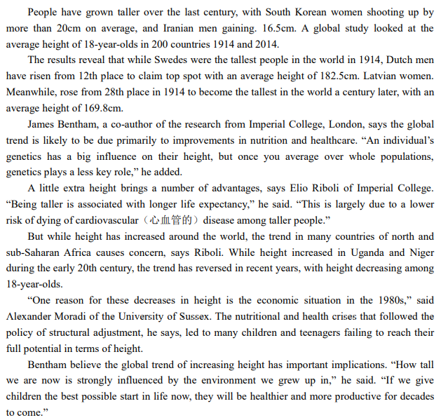

​					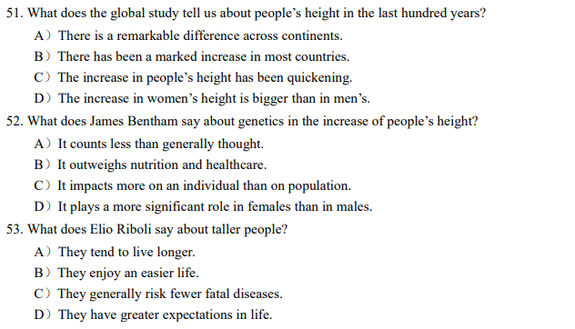
​					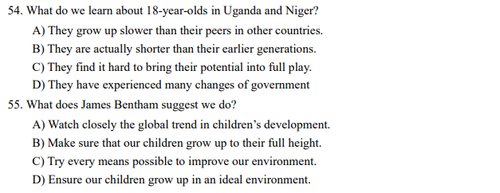

### 2019年6月卷三

**Passage One**

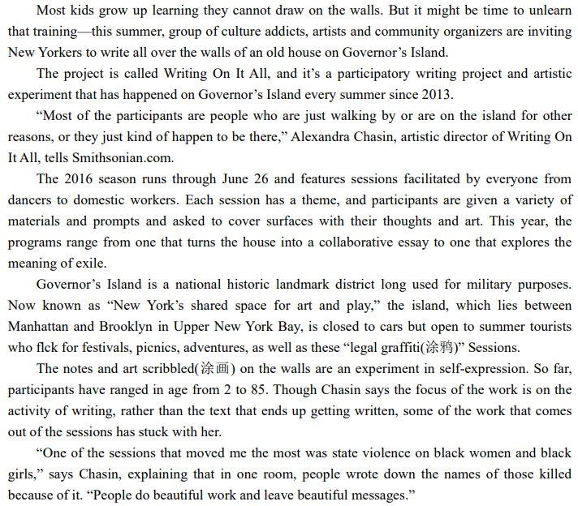

46. What does the project Writing On It All invite people to do? 
    A) Unlearn their training in drawing. 
    B) Participate in a state graffiti show. 
    C) Cover the walls of an old house with graffiti. 
    D) Exhibit their artistic creations in an old house.
47. What do we learn about the participants in the project? 
    A) They are just culture addicts. 
    B) They are graffiti enthusiasts. 
    C) They are writers and artists. 
    D) They are mostly passers-by.
48. What did the project participants do during the 2016 season? 
    A) They were free to scribble on the walls whatever came to their mind. 
    B) They expressed their thoughts in graffiti on the theme of each session. 
    C) They learned the techniques of collaborative writing. 
    D) They were required to cooperate with other creators. 
49. What kind of place is Governor’s Island? 
    A) It is a historic site that attracts tourists and artists. 
    B) It is an area now accessible only to tourist vehicles. 
    C) It is a place in Upper New York Bay formerly used for exiles. 
    D) It is an open area for tourists to enjoy themselves year round. 
50. What does Chasin say about the project? 
    A) It just focused on the sufferings of black females. 
    B) It helped expand the influence of graffiti art. 
    C) It has started the career of many creative artists. 
    D) It has created some meaningful artistic works.

**Passage Two**

Online programs to fight depression are already commercially available. While they sound efficient and cost-saving, a recent study reports that they are not effective, primarily because depressed patients are not likely to engage with them or stick with them. 

The study looked at computer-assisted cognitive( 认 知 的 ) behavioral therapy(CBT) and found that it was no more effective in treating depression than the usual care patients receive from a primary care doctor. 

Traditional CBT is considered an effective form of talk therapy for depression, helping people challenge negative thoughts and change the way they think in order to change their mood and behaviors. However, online CBT programs have been gaining popularity, with the attraction of providing low-cost help wherever someone has access to a computer. 

A team of researchers from the University of Y ork conducted a randomized(随机的) control trial with 691 depressed patients from 83 physician practices across England. The patients were split into three groups: one group received only usual care from a physician while the other two groups received usual care from a physician plus one of two computerized CBT programs. Participants were balanced across the three groups for age, sex, educational background, severity and duration of depression, and use of antidepressants(抗抑郁药). 

After four months, the patients using the computerized CBT programs had no improvement in depression levels over the patients who were only getting usual care from their doctors. 

“It’s an important, cautionary note that we shouldn’t get too carried away with the idea that a computer system can replace doctors and therapists,” says Christopher Dowrick, a professor of primary medical care at the University of Liverpool. “We do still need the human touch or the human interaction, particularly when people are depressed.” 

Being depressed can mean feeling “lost in your own small, negative, dark world,” Dowrick says. Having a person, instead of a computer, reach out to you is particularly important in combating that sense of isolation. “When you’re emotionally vulnerable, you’re even more in need of a caring human being ,” he says.

51. What does the recent study say about online CBT programs? 
    A) Patients may not be able to carry them through for effective cure. 
    B) Patients cannot engage with them without the use of a computer. 
    C)They can save patients trouble visiting physicians. 
    D)They have been well received by a lot of patients. 

52. What has made online CBT programs increasingly popular? 
    A) Their effectiveness in combating depression. 
    B) The low efficiency of traditional talk therapy. 
    C)Their easy and inexpensive access by patients. 
    D)The recommendation by primary care doctors. 

53. What is the major finding by researchers at the University of York? 
    A) Online CBT programs are no more effective than regular care from physicians. 
    B) The process of treating depression is often more complicated than anticipated. 
    C) The combination of traditional CBT and computerized CBT is most effective. 
    C) Depression is a mental condition which is to be treated with extreme caution. 
54. What is Professor Dowrick’s advice concerning online CBT programs? 
    A) They should not be neglected in primary care. 
    B) Their effectiveness should not be overestimated. 
    C) They should be used by strictly following instructions. 
    D) Their use should be encouraged by doctors and therapists. 
55. What is more important to an emotionally vulnerable person? 
    A) A positive state of mind. 
    B) Appropriate medication. 
    C) Timely encouragement. 
    D) Human interaction.

### 2019年12月卷一

**Passage One**

Professor Ashok Goel of Georgia Tech developed an artificially intelligent teaching assistant to help handle  the enormous number of student questions in the online class, Knowledge-Based Artificial Intelligence. This  online course is a core requirement of Georgia Tech's online Master of Science in Computer Science program  Professor Goel already had eight teaching assistants, but that wasn't enough to deal with the overwhelming number of daily questions from students.

Many students drop out of online courses because of the lack of teaching support. When students feel  isolated or confused and reach out with questions that go unanswered, their motivation to continue begins to fade  Professor Goel decided to do something to remedy this situation and his solution was to create a virtual assistant  named Jill Watson, which is based on the IBM Watson platform.

Goel and his team developed several versions of Jill Watson before releasing her to the online forums. At  first, the virtual assistant wasn't too great. But Goel and his team sourced the online discussion forum to find all  40,000 questions that had ever been asked since the class was launched. Then they began to feed Jill with the  questions and answers. After some adjustments, and sufficient time, Jill was able to answer the students' questions  correctly 97% of the time. The virtual assistant became so advanced and realistic that the students didn't know she  was a computer. The students, who were studying artificial intelligence, were interacting with the virtual assistant  and couldn't tell it apart from a real human being. Goel didn't inform them about Jill's true identity until April 26  The students were actually very positive about the experience.

The goal of Professor Goel's virtual assistant next year is to take over answering 40% of all the questions posed by students on the online forum. The name Jill Watson will, of course, change to something else next semester. Professor Goel has a much rosier outlook on the future of artificial intelligence than, say, Elon Musk, Stephen Hawking, Bill Gates or Steve Wozniak.

46. What do we learn about Knowledge-Based Artificial Intelligence ?
    A) It is a robot that can answer students' questions.
    B) It is a course designed for students to learn online.
    C) It is a high-tech device that revolutionizes teaching.
    D) It is a computer program that aids student learning.
47. What problem did Professor Goel meet with ?
    A) His students were unsatisfied with the assistants.
    B) His course was too difficult for the students.
    C) Students' questions were too many to handle.
    D) Too many students dropped out of his course.
48. What do we learn about Jill Watson ?
    A) She turned out to be a great success.								B) She got along pretty well with students.
    C) She was unwelcome to students at first.						   D) She was released online as an experiment.
49. How did the students feel about Jill Watson?
    A) They thought she was a bit too artificial.
    B) They found her not as capable as expected.
    C) They could not but admire her knowledge.
    D) They could not tell her from a real person.
50. What does Professor Goel plan to do next with Jill Watson?
    A) Launch different versions of her online.
    B) Feed her with new questions and answers.
    C) Assign her to answer more of students' questions.
    D) Encourage students to interact with her more freely.

**Passage Two**

Thinking small, being engaging, and having a sense of humor don't hurt. Those are a few of the traits of successful science crowdfunding efforts that emerge from a recent study that examined nearly 400 campaigns. But having a large network and some promotional skills may be more crucial.

Crowdfunding, raising money for a project through online appeals, has taken off in recent years for everything from making movies to producing water-saving gadgets. Scientists have tried to tap Internet donors, too, with mixed success. Some raised more than twice their goals, but others have fallen short of reaching even modest targets.

To determine what separates science crowdfunding triumphs from failures, a team led by science communications scholar Mike Schafer of the University of Zurich examined the content of the webpages for 371 recent campaigns.

Four traits stood out for those that achieved their goals, the researchers report in *Public Understanding of Science*. For one, they use a crowdfunding platform that specializes in raising money for science, and not just any kind of project. Although sites like Kickstarter take all comers, platforms such as Experiment. com and Petridish. org only present scientific projects. For another, they present the project with a funny video because good visuals and a sense of humor improved success. Most of them engage with potential donors, since projects that answered questions from interested donors fared better. And they target a small amount of money. The projects included in the study raised $4000 on average, with 30% receiving less than $1000. The more money a project sought, the lower the chance it reached its goal, the researchers found .

Other factors may also significantly influence a project's success, most notably, the size of a scientist's personal and professional networks, and how much a researcher promotes a project on their own. Those two factors are by far more critical than the content on the page. Crowdfunding can be part of researchers' efforts to reach the public, and people give because “they feel a connection to the person”who is doing the fundraising- -not necessarily to the science.

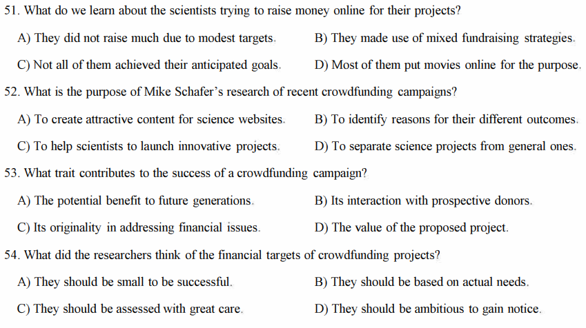
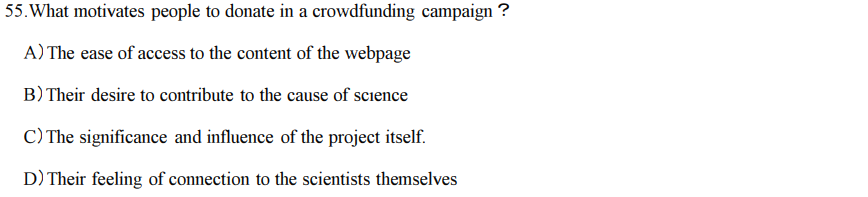

### 2019年12月卷二

**Passage One**

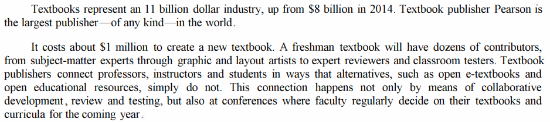
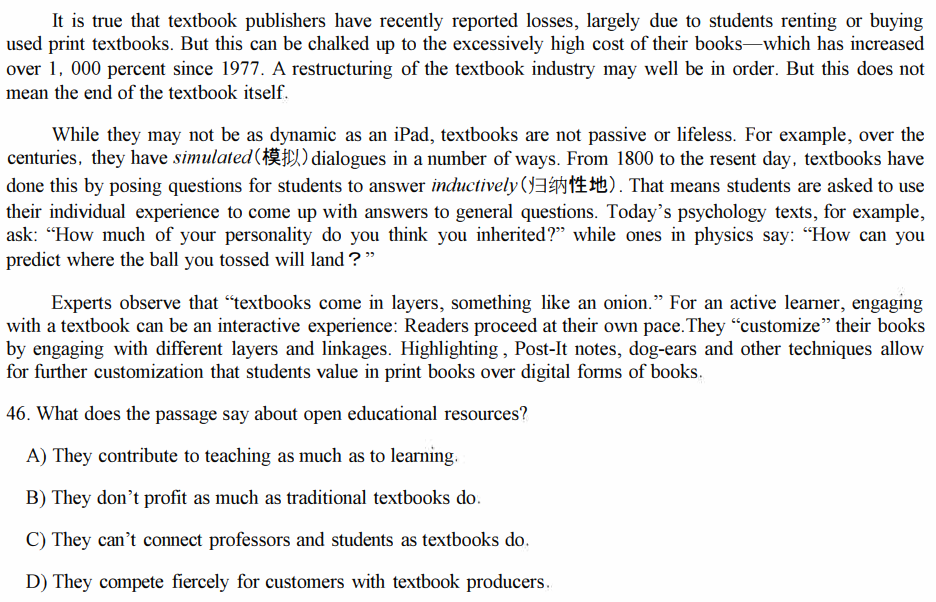
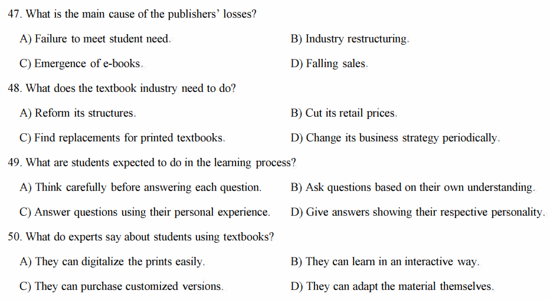

**Passage Two**

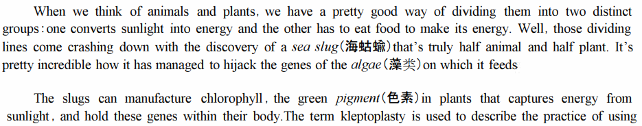
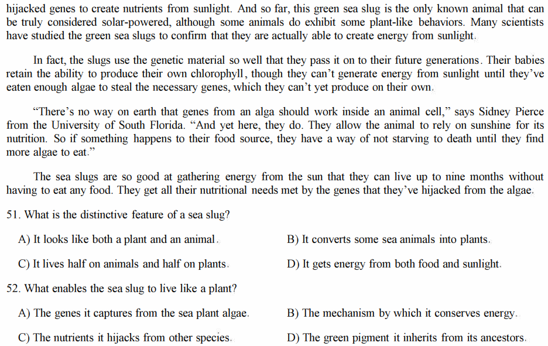
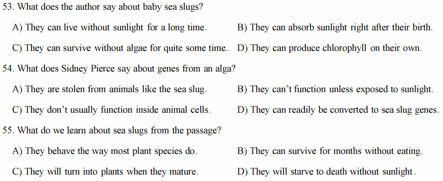

### 2019年12月卷三

**Passage One**

The fifth largest city in the US passed a significant soda tax proposal that will levy (征税） 1.5cents per liquid  ounce on distributors.

Philadelphia 's new measure was approved by a 13 to 4 city council vote. It sets a new bar for similar  initiatives across the country. It is proof that taxes on sugary drinks can win substantial support outside super­-liberal areas. Until now, the only city to successfully pass and implement a soda tax was Berkeley, California, in  2014.

The tax will apply to regular and diet sodas, as well as other drinks with added sugar, such as Gatorade and  iced teas. It's expected to raise $410 million over the next five years, most of which will go toward funding  a universal pre-kindergarten program for the city.

While the city council vote was met with applause inside the council room, opponents to the measure,  including soda lobbyists, made sharp criticisms and a promise to challenge the tax in court.

"The tax passed today unfairly singles out beverages—including low-and no-calorie choices," said Lauren  Kane, spokeswoman for the American Beverage Association. "But most importantly , it is against the law. So we  will side with the majority of the people of Philadelphia who oppose this tax and take legal action to stop it ."

An industry-backed anti-tax campaign has spent at least $4 million on advertisements. The ads criticized the  measure, characterizing it as a "grocery tax ". 

Public health groups applauded the approved tax as a step toward fixing certain lasting health issues that  plague Americans. "The move to recapture a small part of the profits from an industry that pushes a product that  contributes to diabetes, obesity and heart disease in poorer communities in order to reinvest in those communities will sure be inspirational to many other places," said Jim Krieger, executive director of Healthy Food America. "Indeed, we are already hearing from some of them. It's not 'just Berkeley' anymore." 

Similar measures in California's Albany, Oakland, San Francisco and Colorado's Boulder are becoming hot-button issues. Health advocacy groups have hinted that even more might be coming.

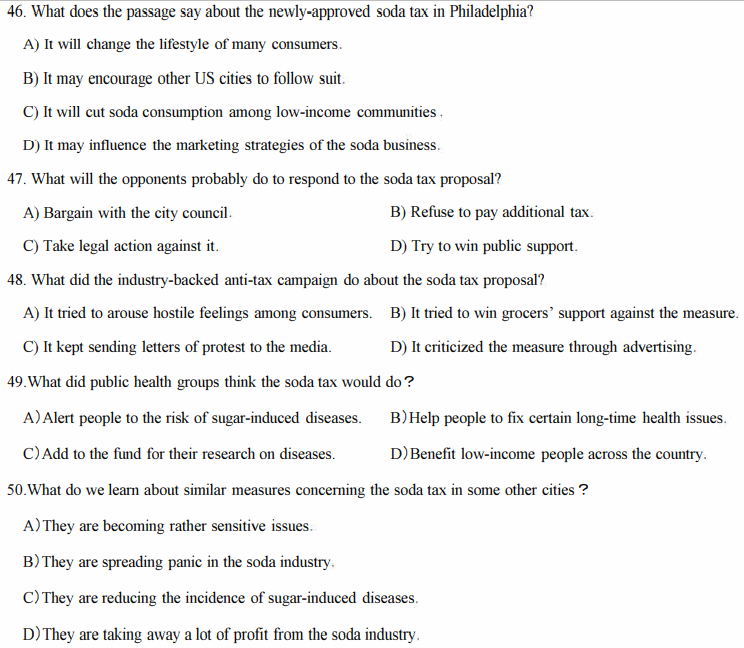

**Passage Two**

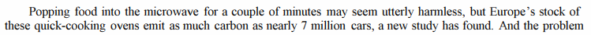
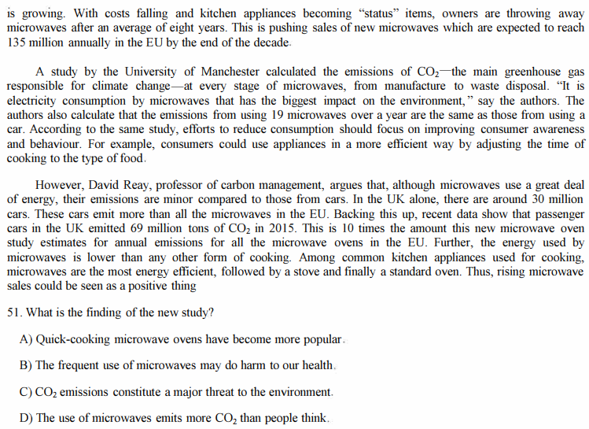
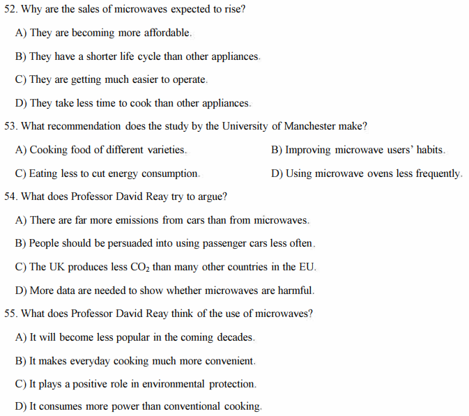